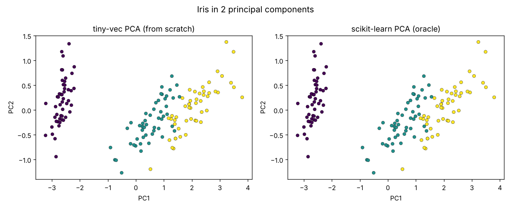

# tiny-vec

[](https://github.com/kashyapphassan2000-netizen/AI-DOUNDATIONS-WEEK-01/actions/workflows/ci.yml)

Linear algebra and reverse-mode autograd from first principles. Pure Python, zero runtime dependencies. NumPy is used **only in tests** as the oracle.

Live page: https://kashyapphassan2000-netizen.github.io/AI-DOUNDATIONS-WEEK-01/ (GitHub Pages, deployed by `.github/workflows/pages.yml`)

## What's inside

| Module | What it does |
|---|---|
| `tiny_vec/vector.py` | `Vector`: add, sub, scalar mul, dot, L1/L2/Lp norm, normalize |
| `tiny_vec/matrix.py` | `Matrix`: transpose, naive matmul, Strassen matmul |
| `tiny_vec/engine.py` | `Value`: scalar reverse-mode autodiff (topological sort + chain rule) |
| `tiny_vec/nn.py` | `Neuron` / `Layer` / `MLP` built on `Value` |
| `tiny_vec/linalg.py` | SVD via power iteration + deflation, PCA on top |

## Install from TestPyPI

```bash
pip install -i https://test.pypi.org/simple/ kashyap-tiny-vec
python -c 'from tiny_vec import Value; v=Value(2); (v*v).backward(); print(v.grad)'   # 4.0
```

Published by `.github/workflows/publish.yml` (run it from the Actions tab) using PyPI trusted publishing, so no API token is stored anywhere.

## Run it

```bash
pip install -e ".[dev]"
pytest --cov=tiny_vec --cov-report=term-missing   # 11 tests, 80% coverage
python examples/train_xor.py                      # MLP learns XOR, loss -> ~0
python examples/pca_iris.py                       # writes docs/iris_pca.png
python bench/matmul.py --sizes 128,256,512 --leaf 32
```

## Benchmark: naive vs Strassen (pure Python)

Measured in the build container (Python 3.13, one run per size, so treat as indicative):

| n | naive (s) | strassen (s) | winner |
|---:|---:|---:|---|
| 128 | 0.1211 | 0.1369 | naive |
| 256 | 0.9501 | 1.0464 | naive |
| 512 | 10.7407 | 7.2658 | strassen |

**Result:** Strassen only wins at n=512 here. The textbook crossover is lower; in pure Python the interpreter inflates the constant cost of the extra matrix additions, so the crossover moves up. (The step-by-step guide's sample run showed ~256; on this machine it did not.)

**NumPy gap:** 128x128 matmul took 0.107 s in tiny-vec vs 0.00047 s in NumPy, about **229x slower**. NumPy dispatches to optimized C/BLAS with contiguous memory; pure Python pays interpreter overhead on every multiply-add.

## Autograd + XOR

`Value` records parents and a local backward closure per op. `backward()` topologically sorts the graph and applies the chain rule in reverse; `+=` on gradients handles values used more than once. A gradient test compares analytic grads against finite differences. `examples/train_xor.py` trains a 2-8-8-1 MLP (105 params) to loss < 0.01 with plain SGD.

## SVD / PCA

Right singular vectors of A are eigenvectors of AᵀA. Power iteration finds the dominant one, deflation removes it, repeat. `examples/pca_iris.py` projects iris to 2D and compares against scikit-learn:



PC1 captures ~94.6% of the top-2 variance. Axes may be sign-flipped vs scikit-learn; that is expected.

## Limits (be honest)

- Power-iteration SVD is slow and loses accuracy when singular values are nearly equal. Fine for learning, not for production.
- Scalar autograd is orders of magnitude slower than tensor autograd.
- Vector/Matrix are list-of-floats; no broadcasting, no views.
